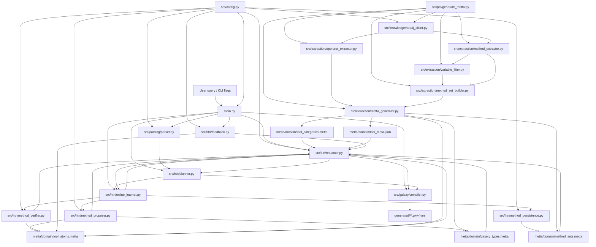

# Project Pipeline

## Runtime Pipeline

The main runtime entrypoint is [main.py](/Users/m4pro/git/galaxy-htn-neurosym/main.py). It loads the MeTTa knowledge base through `PLNReasoner`, then follows one of three paths:

1. `--task`: direct HTN planning for one task.
2. natural-language query: parse query -> plan tasks -> compile Galaxy workflow YAML.
3. `--feedback`: revise tool truth values after execution outcomes.

### Normal NL -> Workflow flow

`main.py`
-> `src/pln/reasoner.py` loads `metta/domain/*.metta` and `tool_meta.json`
-> `src/parsing/parser.py` converts NL into ordered task categories
-> `src/htn/planner.py` picks the best method for each task using PLN scores
-> `src/galaxy/compiler.py` reconstructs dataflow and emits `.gxwf.yml`
-> `generated/<timestamp>/*.gxwf.yml`

### Learning-on-gap flow

If `--learn` is enabled and planning is weak or impossible:

`main.py`
-> `src/htn/online_learner.py`
-> `src/htn/method_proposer.py`
-> `src/htn/method_verifier.py`
-> `src/htn/method_persistence.py`
-> updated `metta/domain/method_sets.metta`
-> reload `src/pln/reasoner.py`
-> re-run `src/htn/planner.py`

### Feedback flow

`main.py --feedback`
-> `src/htn/feedback.py`
-> `src/pln/reasoner.py.pln_revision()`
-> rewrite `metta/domain/tool_atoms.metta`

## Knowledge-Building Pipeline

The offline knowledge-building pipeline starts from Neo4j and generates the MeTTa domain files consumed at runtime:

`scripts/generate_metta.py`
-> `src/knowledge/neo4j_client.py`
-> `src/extraction/operator_extractor.py`
-> `src/extraction/method_extractor.py`
-> `src/extraction/variable_lifter.py`
-> `src/extraction/method_set_builder.py`
-> `src/extraction/metta_generator.py`
-> `metta/domain/tool_atoms.metta`
-> `metta/domain/method_sets.metta`
-> `metta/domain/galaxy_types.metta`
-> `metta/domain/tool_categories.metta`
-> `metta/domain/tool_meta.json`

## File-to-File Diagram

## High-Signal File Roles

- [main.py](/Users/m4pro/git/galaxy-htn-neurosym/main.py): top-level CLI orchestrator.
- [src/pln/reasoner.py](/Users/m4pro/git/galaxy-htn-neurosym/src/pln/reasoner.py): loads MeTTa KB and computes method/tool scores.
- [src/parsing/parser.py](/Users/m4pro/git/galaxy-htn-neurosym/src/parsing/parser.py): turns natural language into closed-vocabulary task lists.
- [src/htn/planner.py](/Users/m4pro/git/galaxy-htn-neurosym/src/htn/planner.py): selects methods and chains plans across tasks.
- [src/galaxy/compiler.py](/Users/m4pro/git/galaxy-htn-neurosym/src/galaxy/compiler.py): converts plans into Galaxy Format 2 YAML.
- [src/htn/online_learner.py](/Users/m4pro/git/galaxy-htn-neurosym/src/htn/online_learner.py): gap-handling loop for method acquisition.
- [scripts/generate_metta.py](/Users/m4pro/git/galaxy-htn-neurosym/scripts/generate_metta.py): builds the symbolic runtime domain from Neo4j.
